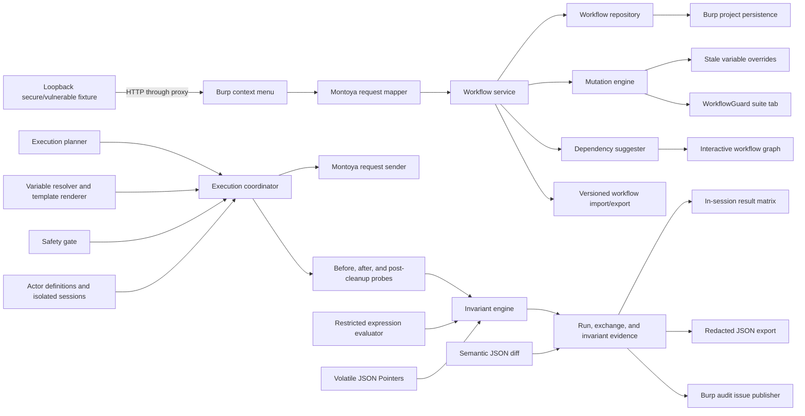

# Architecture

## Objective

The first release should capture a legitimate workflow and generate a small, explainable set of unsafe-order candidates without coupling the mutation logic to Burp Suite.



## Layers

### Domain

Immutable workflows, actors, actor-assigned steps, mutation cases, variable definitions, invariants, and execution policy. The layer has no dependency on Burp or Swing.

### Core

Pure or deterministic services:

- `MutationEngine`
- `ExecutionRunSummarizer`
- `WorkflowDependencySuggester`
- `ExecutionPlanner`
- `VariableResolver`
- `HttpRequestTemplateRenderer`
- `HttpRequestText`
- `IsolatedActorCookieJar`
- `SemanticJsonDiff`
- `InvariantEngine`
- `InvariantExpressionEvaluator`
- `SafetyGate`
- `StepClassifier`
- `WorkflowValidator`

These classes can be tested with ordinary unit tests.

Dependency suggestions are derived rather than persisted. Variable use produces
high-confidence data edges, known lifecycle transitions produce medium or high
confidence edges, and otherwise-adjacent captured actions produce low-confidence
order edges. The UI graph collapses multiple relationships between the same two
steps to the strongest visible edge while retaining every reason in the evidence
table.

### Application

`WorkflowService` coordinates use cases and exposes snapshots to adapters. It owns the active-workflow concept but persists through the `WorkflowRepository` port.

### Adapters

- Montoya adapter: extension initialization, context-menu registration, and HTTP message conversion.
- Swing adapter: suite tab and table models.
- Persistence adapters: a versioned JSON repository backed by Burp project extension data, with an in-memory fallback when project persistence is unavailable.

## Execution boundary

Mutated traffic is sent only through this controlled path:

```text
ExecutionCoordinator
├── SafetyGate
├── ExecutionPlan
│   ├── before probes
│   ├── mutated actions
│   ├── after probes
│   ├── cleanup
│   └── post-cleanup probes
├── VariableResolver
├── per-actor, per-origin cookies and Authorization
├── InvariantEngine
├── MontoyaRequestSender
├── DelayStrategy
└── immutable run evidence
```

No request reaches `MontoyaRequestSender` until the complete expanded plan passes the safety gate. The gate requires the raw request method and Host/origin to match the modeled step. After variable rendering, the coordinator derives the effective URL from the actual request target, revalidates that URL against current Burp scope, counts probes and cleanup against the hard request cap, enforces the inter-request delay, prevents overlapping runs, and records missing responses or sender failures. Before each send it replaces captured cookies with the selected actor's isolated jar; response `Set-Cookie` headers update only that actor and origin. A configured actor authorization seed also replaces the captured `Authorization` header. Configured credentials are bound to exactly one origin and a multi-origin actor plan is blocked. A custom actor without a seed sends no captured authorization, while the default captured-session actor retains the captured header for backward compatibility. If a primary request fails after mutation traffic began, cleanup remains best-effort; if the failure happened before mutation, cleanup is skipped.

Probe responses feed dynamic variables and JSON invariants. Regex extraction uses RE2/J to preserve linear-time matching, and every extracted or stale value is size-bounded and rejected if it contains HTTP control characters. Configured stale mutations override named variables only while rendering mutation-phase requests; probes and cleanup continue to use values extracted by the legitimate sequence. `UNCHANGED` checks use the semantic diff engine and omit workflow-configured volatile JSON Pointers. Expression checks are parsed by a fixed grammar and cannot invoke Java, scripts, reflection, files, or network APIs.

Cleanup is followed by the same probes so restoration is verified against the original baseline rather than inferred from an HTTP status. A pure summarizer classifies each run as verified, mutation violation, restored violation, cleanup failure, execution failure, blocked, cancelled, or not evaluated; the Swing matrix retains the latest 50 summaries in memory, while complete HTTP evidence exists only for the latest run. Evidence export is explicit and conservative: it removes HTTP headers, bodies, response reason phrases, and cookie names; masks query and identifier values; and replaces all extracted variables, actor-session data, and invariant values.

Failed post-mutation invariants can be published through the Montoya Site map as informational audit issues. The adapter attaches the run's HTTP exchanges but intentionally does not assign vulnerability impact from response differences alone. Burp Community accepts the publication call but does not expose the **All issues** viewer; edition-aware UI copy directs Community users to WorkflowGuard's own evidence and redacted export. Workflow archives have an independent size-bounded versioned envelope, validate methods, origins, collection sizes, fields, and all internal step, actor, variable, and probe references on import, and apply best-effort session redaction by default.

## Threading

Swing state is updated on the event-dispatch thread. Network execution runs on a single bounded background executor and publishes immutable results back to Swing. The executor is shut down through the extension-unloading handler.
