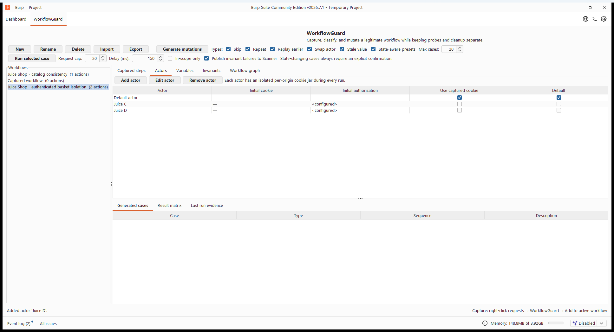
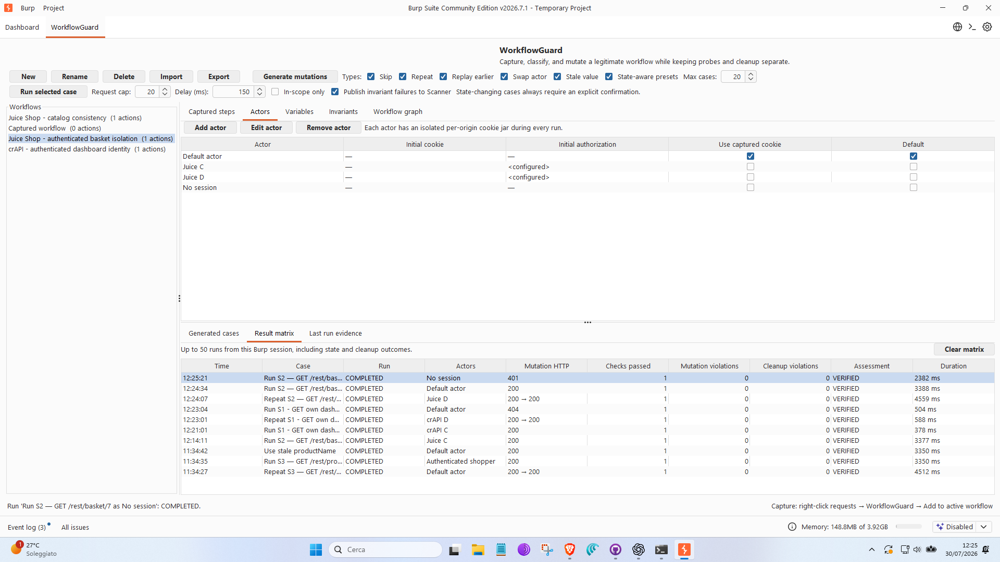
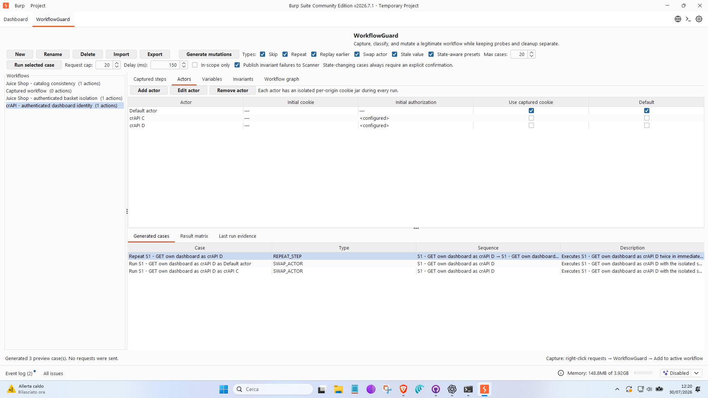
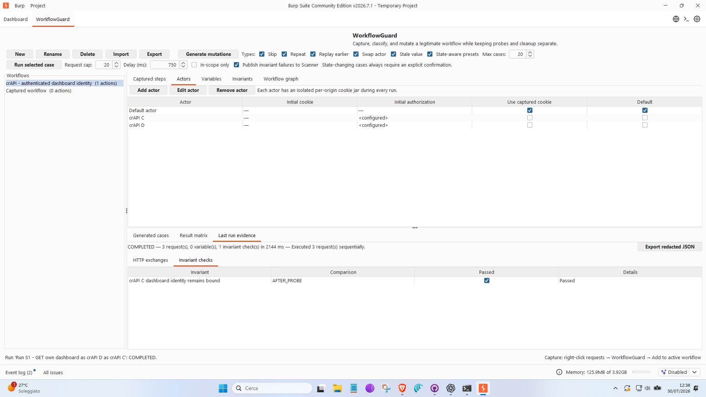

# WorkflowGuard 0.3.1 authenticated UI validation

Date: 2026-07-30

## Outcome

WorkflowGuard was exercised end to end from the Burp user interface against
authorized loopback-only Juice Shop and crAPI laboratories. The campaign
generated and executed ten mutation cases. Every case completed, every
configured probe check ran, and no state-changing request was sent.

The validation found and fixed two application defects:

1. edited HTTP requests could lose CRLF framing before Montoya sent them;
2. the redacted evidence export removed credentials but retained e-mail
   addresses from JSON response bodies.

The fixed JAR was loaded in a fresh Burp process. A final crAPI actor-swap
workflow completed three HTTP exchanges, passed its identity invariant, and
produced an evidence export without live Authorization values, e-mail
addresses, or password values.

## UI campaign

| Workflow | Generated | Executed | Result |
| --- | ---: | ---: | --- |
| Juice Shop catalog consistency | 3 | 3 | Completed |
| Juice Shop authenticated basket isolation | 4 | 4 | Completed |
| crAPI authenticated dashboard identity | 3 | 3 | Completed |
| **Total** | **10** | **10** | **10 completed** |

The authenticated runs used separate actor configurations. The UI displayed
only `<configured>` for Authorization seeds. The explicit no-session Juice
Shop control was rejected with HTTP 401.

## Target assessment

- Juice Shop basket isolation: **candidate violation**, reproduced with both
  supplied actor pairs. This is a finding in the intentionally vulnerable
  laboratory target, not a WorkflowGuard failure.
- crAPI dashboard identity binding: **pass** for both actor pairs.
- crAPI vehicle-location isolation: **inconclusive** because none of the four
  supplied laboratory accounts owns the required vehicle object.

WorkflowGuard's `VERIFIED` assessment means that a replay completed and its
configured probe invariant passed. It does not mean that the target is free
of authorization defects.

## Independent review

AGY and Codex independently agreed that:

- scope and safety constraints were consistent;
- all UI cases were executed;
- Juice Shop basket isolation was violated;
- crAPI dashboard identity binding passed;
- the vehicle-location case remained inconclusive;
- the post-fix privacy redaction passed.

AGY remained evidence-only: it did not access targets, browsers, network tools,
shell commands, or credentials.

## Automated regression

- Full Gradle suite: 67 tests, 0 failures, 0 errors, 1 environment-gated skip.
- Real production-coordinator lab replay: 1 test, 0 failures, 0 skips.
- AGY configuration gate: 18 hook assertions and 2 validator assertions passed.
- Engagement validator: active, approved, loopback-only scope.

## Release artifact

- JAR: `build/libs/workflowguard-0.3.1.jar`
- Size: 2,703,647 bytes
- SHA-256:
  `4DDE0323E0BD8317733A414964E2B7A8BE41C95574359399690AA95FBD7D77A5`

## Evidence

- [Sanitized campaign summary](evidence/ui-authenticated-validation-20260730/ui-authenticated-summary-20260730.json)
- [AGY post-fix review](evidence/ui-authenticated-validation-20260730/agy-ui-evidence-review-postfix-20260730.json)
- [Codex post-fix review](evidence/ui-authenticated-validation-20260730/codex-ui-evidence-review-postfix-20260730.json)
- [Post-fix UI evidence](evidence/ui-authenticated-validation-20260730/crapi-cd-ui-evidence-postfix.json)
- Screenshots:
  `docs/screenshots/ui-authenticated-20260730/selected/`

## Selected screenshots

These screenshots document the historical `0.3.1` authenticated campaign. They
use the pre-`0.3.2` **Scanner** wording; the current edition-aware UI labels the
same operation as Burp issue publication.

